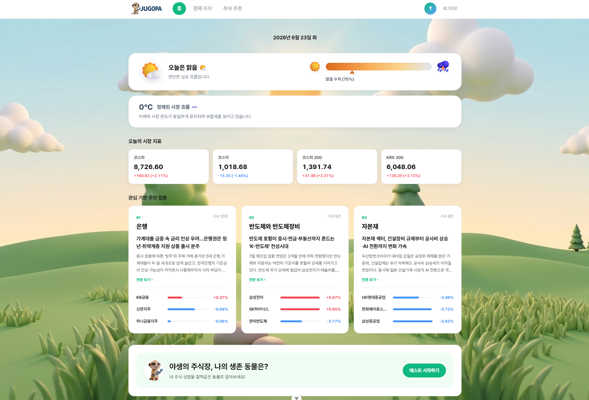
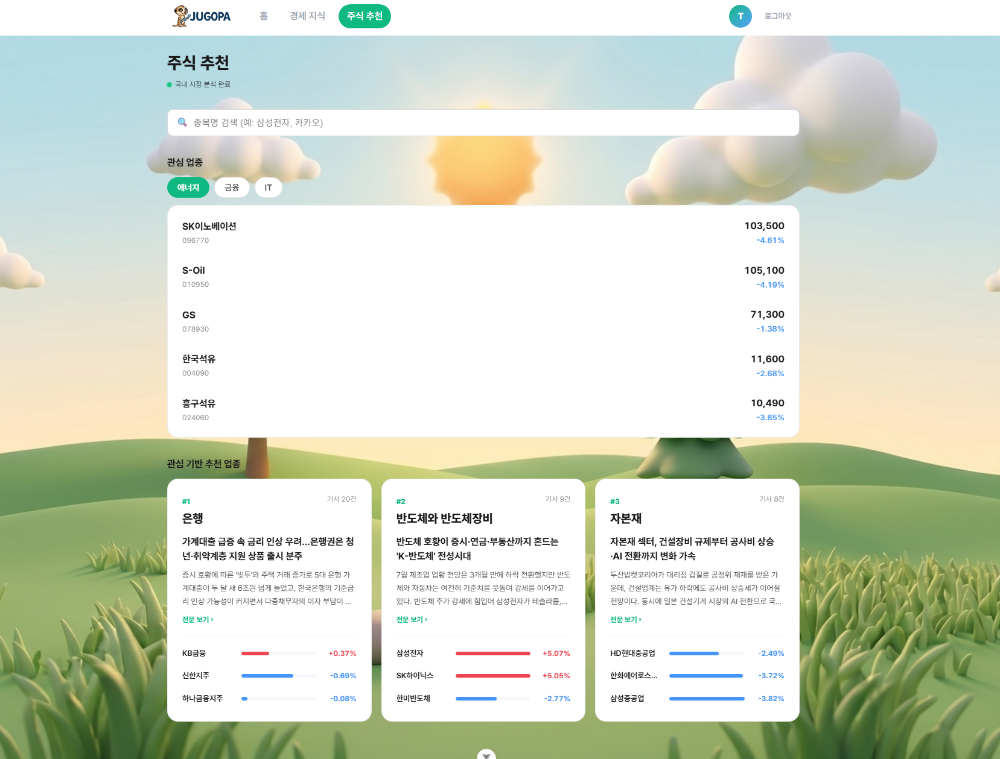
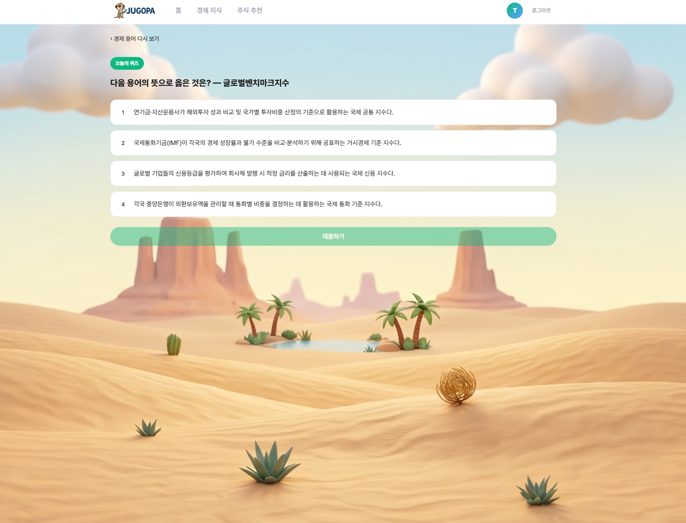
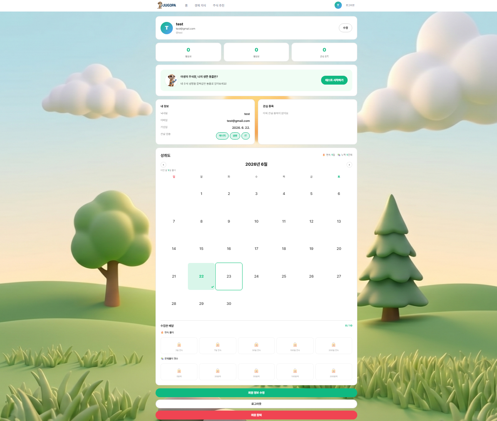

# 💡 주식 고수가 되고파 (주고파)

## 👥 팀원 소개 및 역할
- **정시영** (Backend / Git management)
- **정다운** (Frontend / AI / Deploy)
- **김수빈** (Frontend & Backend / Design / AI)


## 📈 서비스 소개
**"복잡한 주식 시장, 오늘 나의 투자 날씨는 맑음일까?"**

수많은 뉴스와 시장 지표를 분석하여 오늘의 투자 방향성을 제시하고, 매일 성장하는 경제 습관을 길러주는 주식 투자 가이드 서비스 **주고파**(주식의 고수가 되고파)입니다.


## 🎯 타깃 유저
- **🐣 주식 입문자** : 복잡한 경제 지표와 쏟아지는 뉴스 속에서 무엇부터 봐야 할지 모르는 초보 투자자


## 🖥️ 화면 구성 및 주요 기능
**1. 홈 페이지: 투자 기상도**
코스피, 코스닥 지수를 종합 분석한 직관적인 '투자 기상도'와 최신 증시 요약을 제공합니다.


**2. 주식 추천 페이지: 관심 업종 & 카드뉴스**
관심 업종의 시가총액 상위 대장주를 정렬하여 보여주며, AI 분석을 통한 유망 업종 카드뉴스를 제공합니다.


**3. 경제 지식 페이지: 주린이 튜터**
매일 제공되는 주식 용어와 퀴즈를 통해 주린이도 쉽게 경제 지식을 테스트하고 학습할 수 있습니다.


**4. 마이페이지: 투자 성향 분석**
관심 업종 및 종목을 관리하고, 사용자 투자 성향을 분석한 사바나 동물 캐릭터 결과를 확인할 수 있습니다.



## ✨ 핵심 기능
**📊 1. 사용자 맞춤형 증권 대시보드**
- `🌤️ 투자 기상도`: 코스피, 코스닥 등 대표 경제 지수를 종합 분석하여, '오늘 투자하기 좋은 날인지'를 직관적인 날씨(기상도) 지표로 메인 페이지에 제공합니다. 뿐만 아니라, *"어제보다 5도 정체되었습니다", "체감 온도가 급격히 얼어붙었습니다"* 등 시장의 변화 속도를 감각적인 문구로 제공합니다. 다이내믹하게 급변하는 주식 시장의 흐름(투자 온도차)을 훨씬 생생하게 체감할 수 있습니다.

- `🎯 산업군 추천 큐레이션`: 뉴스의 텍스트를 감정분석(긍정/부정)해 트렌드를 바탕으로 현재 가장 주목받고 있는 유망 업종(산업군)을 도출하여 추천하고, 그 이유를 카드뉴스를 통해 보여줍니다.

- `📈 TOP 10 종목 차트`: 추천된 4가지 섹터별로 상위 10개 종목의 과거 종가 데이터를 시각화하여, 주가 변동 추이를 한눈에 파악할 수 있는 차트를 제공합니다.

**🐣 2. 주린이 튜터**
- `🧠 오늘의 주식 용어 & 퀴즈`: 자체 구축된 데이터베이스에서 매일 핵심 주식 용어 1개를 선정하여, 알기 쉬운 설명과 함께 데일리 콘텐츠로 제공합니다. 매일 학습한 내용을 바탕으로 나의 경제 지식 성취도를 점검할 수 있는 퀴즈와 맞춤형 피드백을 제공합니다.

**💬 3. 소통형 커뮤니티 및 안전한 회원 관리**
- `👥 정보 공유 게시판 (종목 토론방)`: 회원들이 자유롭게 자신의 투자 의견과 포트폴리오를 나누고 소통할 수 있는 커뮤니티(CRUD) 공간을 제공합니다.

- `🤝 관심 유저 팔로우`: 다른 회원을 팔로우하여, 설정해둔 관심 업종이나 종목을 확인할 수 있습니다.

- `🔐 보안 강화 및 회원 관리`: * ID/PW 기반 로그인 및 JWT를 활용한 안전한 세션 유지를 지원합니다. 취약한 비밀번호 설정을 방지하기 위해 '비밀번호 난수 자동 생성 및 추천' 기능을 도입하여 계정 보안을 강화했습니다. 개인정보 조회/수정 및 회원 탈퇴 등 기본적인 내 정보 관리 기능을 제공합니다.

**🤖 4. '주고파' 맞춤형 챗봇 네비게이터**
- 원하는 기능을 찾기 어렵다면? 챗봇이 복잡한 URL 경로 대신 실제 화면 상의 메뉴와 버튼 위치를 자연스러운 언어로 풀어서 안내해 드립니다.

    - 🏠 홈 화면: "상단 로고나 '메인' 메뉴를 클릭하여 투자 기상도를 확인해 보세요."
    - 🔍 주식 추천 및 종목 검색: "상단 네비게이션 바의 '주식 추천' 메뉴에서 추천 섹터를 보거나 종목을 검색할 수 있습니다."
    - 📈 차트 및 종목 토론방: "'주식 추천'에서 카드를 클릭해 상세 페이지로 이동한 뒤 차트를 보거나, '종목 토론방' 버튼을 눌러보세요."
    - 🎓 경제 지식 및 퀴즈: "상단 '경제 지식' 메뉴에서 오늘의 용어를 확인하고, '퀴즈 풀러 가기' 버튼을 눌러보세요."
    - 👤 마이페이지: "화면 우측 상단의 '내 정보' 또는 '마이페이지' 아이콘을 클릭하면 찜한 종목을 볼 수 있습니다."

**🦁 5. 야생의 주식장, 나의 생존 동물은? (투자 성향 테스트)**
- 목표 수익 / 투자 기간 / 정보 수집 / 생존 방식 / 위기 대처 등 5개 지표를 바탕으로 사용자의 투자 성향을 총 32개의 '사바나 야생동물'로 캐릭터화하여 분류합니다.
- 나의 투자 스타일을 재미있게 분석해 결과를 친구들과 공유하며 즐길 수 있는 강력한 바이럴(신규 사용자 유입) 포인트를 제공합니다.

## 🤖 추천 알고리즘에 대한 기술적 설명
'주고파' 서비스는 단순 시가총액 비교가 아닌, **실제 시장의 트렌드(뉴스)를 반영한 하향식(Top-Down) 주식 추천 알고리즘**을 구현했습니다. 전체 알고리즘 파이프라인은 다음과 같이 작동합니다.
1. **데이터 수집 (크롤링)**: 매일 자정, `BeautifulSoup`을 활용하여 주요 포털의 금융/증권 뉴스를 섹터별로 수집합니다.
2. **AI 감성 분석 (NLP)**: 수집된 뉴스 텍스트는 금융 도메인 특화 언어 모델인 `snunlp/KR-FinBert-SC`를 통해 분석됩니다. AI가 뉴스 문맥을 파악하여 해당 뉴스가 시장에 '긍정(Positive)'인지 '부정(Negative)'인지 확률 스코어를 계산하여 분류합니다.
   * *최적화 포인트*: 무거운 딥러닝 모델의 초기화 오버헤드를 막기 위해, HuggingFace의 `pipeline`을 백엔드 서버 메모리에 최초 1회만 적재하는 **싱글턴(Singleton) 패턴**을 적용하여 분석 속도를 최적화했습니다.
3. **유망 업종(섹터) 도출**: 감성 분석 결과, '긍정' 기사가 가장 많이 누적된 상위 4개 섹터를 '오늘의 유망 업종'으로 랭킹화합니다.
4. **대장주 추천**: 도출된 유망 섹터 내에서 시가총액 데이터를 기준으로 상위 10개 종목(대장주)의 정보를 추출하고, 과거 종가 데이터를 조합하여 동적 차트와 함께 사용자에게 최종 추천합니다.

## 💡 생성형 AI를 활용한 부분
본 프로젝트에서는 사용자 경험을 극대화하고 데이터의 품질을 통제하기 위해 두 가지 영역에서 생성형 AI(LLM) 프롬프트 엔지니어링을 적극 활용했습니다.
**1. [데이터 구조화] 카드뉴스 자동 생성 (JSON Schema 활용)**
*   **활용 내용**: AI 감성 분석으로 도출된 유망 섹터의 관련 뉴스들을 프론트엔드 UI(카드뉴스)에 맞게 요약하기 위해 LLM을 활용했습니다.
*   **프롬프트 설계**: 단순한 텍스트 출력이 아닌, 프론트엔드에서 파싱 에러 없이 렌더링할 수 있도록 `response_format: json_schema`를 적용했습니다. AI가 반드시 `headline(한줄요약)`, `summary(본문)`, `key_points(핵심이슈 배열)` 형태의 JSON 객체로만 응답하도록 강제하여 데이터 구조의 안정성을 확보했습니다.
**2. [사용자 경험] 챗봇 가드레일 및 페르소나 부여 (RAG 기반 제어)**
*   **활용 내용**: 서비스 내 길잡이 역할을 하는 '주고파 도우미 챗봇'이 할루시네이션(거짓 정보)을 일으키거나 위험한 답변을 하지 않도록 시스템 프롬프트를 설계했습니다.
*   **프롬프트 설계**: 
    *   **가드레일(Guardrail)**: 사용자의 입력(Prompt)이 선정적이거나 법률 위배 가능성이 있는지 사전 필터링하는 검증용 프롬프트를 거치도록 설계했습니다.
    *   **제약 사항(Constraints)**: 서비스 소개 정보를 프롬프트에 주입하여 사이트 이용 방법에 대해서만 답변하도록 제한했습니다. 특히 초보자를 위한 교육 플랫폼이라는 점을 명시하여 **"종목 매수/매도 권유 금지", "수익 보장 발언 금지", "URL 직접 노출 대신 버튼명으로 안내"** 등의 엄격한 규칙을 부여했습니다.


## 📂 시스템 구성도

백엔드, 프론트엔드의 역할을 명확히 분리하여 관리합니다.

```text
jugopa/
 ┣ 📂 backend/               # Python, Django DRF (API 및 비즈니스 로직)
 ┃ ┣ 📂 accounts/            # 회원 관리, JWT 인증 및 팔로우 기능
 ┃ ┣ 📂 chatbot/             # '주고파' 맞춤형 챗봇 네비게이터 로직
 ┃ ┣ 📂 community/           # 종목 토론방 및 소통형 커뮤니티 (CRUD)
 ┃ ┣ 📂 config/              # Django 메인 환경 설정 및 최상위 라우팅
 ┃ ┣ 📂 fixtures/            # 기초 주식 용어 등 초기 더미 데이터 세팅용
 ┃ ┣ 📂 news/                # 뉴스 크롤링, AI 감정 분석 및 업종 추천
 ┃ ┣ 📂 stocks/              # 투자 기상도, 시가총액, 주가 지표 분석
 ┃ ┣ 📂 tutors/              # 주린이 기초 가이드, 데일리 경제 퀴즈
 ┃ ┣ 📂 venv/                # 파이썬 독립 가상 환경
 ┃ ┣ 📜 .env                 # 환경 변수 (API 키, DB 정보 등 / Git 제외)
 ┃ ┣ 📜 db.sqlite3           # 로컬 개발 및 테스트용 데이터베이스
 ┃ ┣ 📜 manage.py            # Django 프로젝트 관리 스크립트
 ┃ ┗ 📜 requirements.txt     # 백엔드 의존성 관리 패키지 목록
 ┃
 ┗ 📂 frontend/              # Vue.js (SPA, 동적 차트 및 커뮤니티 UI)
   ┣ 📂 src/                 # 프론트엔드 핵심 소스 코드 (컴포넌트, 뷰, 라우터)
   ┣ 📜 index.html           # 프론트엔드 메인 진입점 HTML
   ┣ 📜 package.json         # 프론트엔드 의존성 관리 및 실행 스크립트
   ┗ 📜 .gitignore           # 프론트엔드 Git 버전 관리 제외 목록
```


## 🔗 주요 기술 스택

|구분|기술 스택|
|:---:|:---|
|**Frontend**|   |
|**Backend**|  & Django REST Framework (DRF)|
|**Database**| (운영: Supabase) ·  (로컬 개발)|
|**AI / Data**|Claude API, snunlp/KR-FinBert-SC, BeautifulSoup|
|**Infra / 배포**|   · Gunicorn · WhiteNoise|
|**ETC**|JWT (Authentication), Postman|


## 🗄️ ERD (데이터베이스 모델링)


## 🚀 설치 및 실행 방법 (Getting Started)

### 🖥️ Frontend
```bash
# 1. 프론트엔드 폴더로 이동
$ cd frontend

# 2. 필수 패키지 설치
$ npm install

# 3. 로컬 개발 서버 실행
$ npm run dev
```

### ⚙️ Backend
```bash
# 1. 백엔드 폴더로 이동
$ cd backend

# 2. 파이썬 가상환경 생성 및 활성화
$ python -m venv venv
$ source venv/Scripts/activate  # (Windows 기준, Mac/Linux는 source venv/bin/activate)

# 3. 필수 패키지 설치
$ pip install -r requirements.txt

# 4. 데이터베이스 마이그레이션 적용
$ python manage.py makemigrations
$ python manage.py migrate

# 5. 종목 최신 시가총액 일괄 업데이트 (선택사항)
$ python manage.py update_market_cap

# 6. 초기 더미 데이터 삽입
$ python manage.py loaddata fixtures/seed_data.json

# 7. 서버 실행
$ python manage.py runserver
```


## 🚀 배포 아키텍처 (Deployment)

운영 환경은 **프론트엔드 / 백엔드 / DB·스토리지**를 분리하여 배포합니다.

| 영역 | 플랫폼 | 역할 |
|:---|:---|:---|
| **Frontend** (Vue SPA) | **Vercel** | 정적 빌드(`npm run build`, `dist`) 호스팅, SPA 라우팅 |
| **Backend** (Django + Gunicorn) | **Render** Web Service | REST API 및 비즈니스 로직 서버 |
| **일배치** (`crawl_news`, `daily_update`) | **Render** Cron Job | 뉴스 크롤링·감정분석·시세 갱신 자동 실행 |
| **DB** (PostgreSQL) | **Supabase** | 운영 데이터베이스 (Session pooler 연결) |
| **미디어** (프로필 이미지) | **Supabase Storage** (S3 호환) | 사용자 업로드 이미지 저장 |

```text
[브라우저]
    │  (정적 자산)
    ▼
 Vercel (Vue SPA) ──/api/v1──▶ Render (Django DRF + Gunicorn) ──▶ Supabase (PostgreSQL)
                                      │                         └──▶ Supabase Storage (media)
                                      └ Render Cron
                                          ├ crawl_news    (00:00 UTC)
                                          └ daily_update  (01:30 UTC)
```

- **배포 흐름**: build 시 `collectstatic` → preDeploy 시 `migrate`(자동) → `gunicorn` 기동
- **시드 데이터**: 무거운 LLM/API 재호출 없이 `python manage.py loaddata fixtures/seed_data.json` **1회**로 종목·섹터·용어·퀴즈·뉴스·카드뉴스 전체 적재 (유저 데이터 제외)
- **환경 변수**: API 키·DB 정보 등 민감 정보는 `.env` 및 Render Environment Group으로 관리 (`render.yaml` Blueprint 기반 배포)

> 📖 **전체 단계별 배포 가이드**(Supabase/Render/Vercel 설정, 환경 변수 목록, 배포 후 검증 체크리스트)는 [`bapo.md`](./bapo.md)를 참고하세요.


## 📋 프로그래밍 요구 사항 및 컨벤션

### 💻 코드 및 구조 컨벤션
* **Backend**: Python `PEP 8` 스타일 가이드를 준수하며, 코드 포맷터로 `Black`을 사용합니다. 클래스는 `PascalCase`, 변수 및 함수는 `snake_case`로 작성합니다. 함수의 들여쓰기(indent depth)를 최소화하여 단일 책임 원칙을 지향합니다.
* **Frontend**: `Vue 3 Style Guide (Essential & Strongly Recommended)`를 준수합니다. 컴포넌트 파일명은 `PascalCase`, 변수는 `camelCase`를 사용합니다.
* **보안**: API Key, DB 비밀번호, JWT 시크릿 키 등 민감 정보는 모두 `.env` 파일로 분리하며 `.gitignore`를 통해 엄격히 관리합니다.

### 🌿 Git / GitHub 협업 규칙
* **Issue 기반 개발**: 모든 작업은 Issue 생성 후 진행하며, `[feat]`, `[fix]` 등 태그를 명시합니다.
* **Branch 전략**: `master` 브랜치 직접 Push를 금지하며, `태그/#이슈번호-기능명` 형태의 Feature Branch 전략을 사용합니다.
* **Commit 메시지**: `{이모지} {태그}: [{기능명}] 커밋 메세지 (#이슈번호)` 형식을 준수합니다. 
  *(예: ✨ feat: [stock-chart] 차트 시각화 기능 구현 (#12))*


## 🎯 프로젝트 목표 및 주요 구현 성과

이 프로젝트는 파편화된 외부 주식 및 경제 데이터를 안정적으로 수집하고, 사용자 친화적인 **SPA(Single Page Application)** 환경에서 직관적으로 제공하는 데 집중했습니다.

* **안정적인 데이터 파이프라인**: 한국투자증권 등 공공데이터 API를 연동하여 실시간 시가총액 및 증권 지표 데이터를 일괄 수집/업데이트하는 로직을 구축했습니다.
* **RESTful API 아키텍처**: Django DRF를 활용하여 효율적인 데이터베이스 관리, 사용자 인증(JWT), 비즈니스 로직 처리를 전담하는 견고한 백엔드 서버를 구현했습니다.
* **직관적인 사용자 경험(UX)**: Vue.js 기반의 부드러운 화면 전환과 직관적인 렌더링, 적응형(Responsive) 다크 모드 UI를 도입하여 초보 투자자도 거부감 없이 쉽게 시장 트렌드를 파악할 수 있도록 돕습니다.
